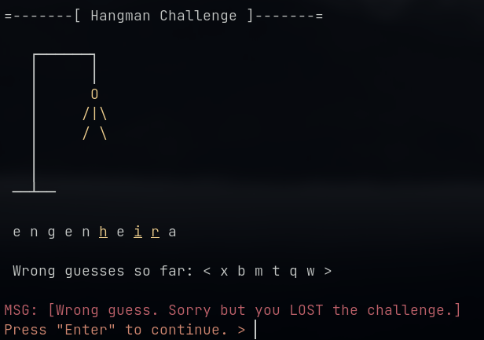

# Projeto de Programação **Jogo da Forca** (_Hangman_)

### Sumário
1. [Introdução](#introdução)
2. [Funcionamento do Jogo](#funcionamento-do-jogo)
3. [Interface](#interface)
4. [Modelagem do Jogo](#modelagem-do-jogo)
5. [Avaliação](#avaliação)
6. [Autoria e Política e Colaboração](#autoria-e-política-de-colaboração)
7. [Entrega](#entrega)

# Introdução

Nesse projeto de programação você deve desenvolver uma versão textual para o **Jogo da Forca** (nome do programa `hangman`). O Jogo da Forca é um jogo popular e fácil de entender, direcionado a testar seus conhecimentos de ortografia na língua Portuguesa ou em outros idiomas. Caso você nunca tenha jogado, é possível experimentar uma versão online chamada de [Racha-Cuca Jogo da Forca](https://rachacuca.com.br/palavras/jogo-da-forca/).

O desenvolvimento desse projeto lhe proporcionará a oportunidade de aprofundar seus conhecimentos sobre uso de classes em C++, bem como utilizar novamente a arquitetura de software _Game Loop_, se assim desejar. Além desses conteúdos, você também deverá ter experiência com a criação de um menu de opções, algo extremamente comum em sistemas de texto orientado a ações, bem como manipulação de cadeias de caracteres (_strings_).

# Funcionamento do Jogo

O Jogo da Forca deve iniciar lendo o nome do jogador para em seguida oferecer um menu de ações. A partir do menu será possível (1) iniciar uma partida, (2) listar as regras do jogo, (3) exibir uma tabela de pontuação geral, ou (4) sair do jogo.

Ao iniciar uma nova partida, o programa deve selecionar uma palavra de forma **aleatória** a partir de um coleção **fixa** de 30 palavras de tamanho variado, cadastradas no código do programa (i.e. _hard coded_). A **_palavra secreta_** escolhida deve ser exibida ao jogador com todas as suas letras escondidas (a não ser que algumas letras sejam sugeridas como reveladas, mais detalhes adiante). Cada letra velada deve ser representada por um caractere '\_', separadas por um espaço em branco adicional. Desta forma, a quantidade de caractere '\_'  representa a quantidade de letras da palavra secreta.

A partir desse momento o jogo recebe sucessivos "chutes" de letras do jogador. São considerados **entradas válidas** qualquer letra do alfabeto latino (26 letras) `[a..z]` ou `[A..Z]`. Apesar de poder receber letras maiúsculas ou minúsculas, o tratamento da entrada não deve diferenciar maiúsculas de minúsculas. Internamente, o jogo deve considerar todas as letras como minúsculas (ou maiúsculas, se assim desejar). Nesta versão devem ser desconsideradas letras acentuadas e o cê-cedilha 'ç'.

A cada chute feito pelo jogador, o `hangman` analisa se a letra pertence à palavra secreta ou não. 
+ Se pertencer, todas as ocorrências da letra correta na palavra são reveladas, ou seja, o caractere `_` é substituído pela letra escolhida em sua posição correta dentro da palavra secreta.
+ Por outro lado, se o caractere não estiver presente na palavra secreta, uma mensagem de erro deve ser exibida. Além da mensagem de erro, o jogo acrescenta mais uma parte do corpo do boneco na forca. A letra errada também deve aparecer em uma lista de "chutes errados" para que o jogador saiba quais letras já foram utilizadas.

De qualquer forma, se o jogador indicar uma letra que já foi utilizadas antes, certa ou errada, o jogo deve ignorar a sugestão e nada acontece (bom, você pode indicar uma mensagem de alerta, se assim desejar).

Para vencer a partida o jogador deve conseguir adivinhar a palavra completamente antes de cometer **seis erros**, ou seja, deve evitar que o bonequinho seja totalmente desenhado na forca.

Durante uma partida em andamento o jogador pode abandonar a partida ao digitar '#' como chute. Qualquer outro caractere, dígito ou símbolo que não seja uma letra válida deve ser ignorado e uma mensagem de erro correspondente deve ser exibida ao cliente.

# Interface

Nessa seção apresento algumas sugestões de _telas_ do sistema como interface com o usuário.

## Tela de abertura


```
$ ./hangman

    ---> Welcome to Hangman, v 1.0 <---
        -copyright DIMAp/UFRN 2022-

 Please, enter your name >
```
Depois de fornecido o nome do jogador, temos a tela com o _menu_ principal de opções.

## Menu principal de opções

```
 =-------[ Main Menu ]-------=

 Please choose an option:
  1 - Start a new challenge.
  2 - Show the game rules.
  3 - Show scoreboard.
  4 - Quit the game.

 Enter your option number and hit "Enter" >
```

Em geral toda tela tem 3 regiões a saber.

```
 =-------[ REGIÃO #1: DO TÍTULO ]-------=

    < REGIÃO #2: CONTEÚDO DA TELA >
    (pode compreender várias linhas)

< REGIÃO #3: de MENSAGEM DO SISTEMA >
< REGIÃO #4: de MENSAGEM DE INTERAÇÃO >
```
Claro, nem sempre as 4 regiões estarão presentes em uma tela. Tome, por exemplo, a tela do menu principal; nela exitem apenas as Regiões 1, 2, e 4. Contudo, se o usuário fornecer uma opção errada, a terceira região será utilizada, como na tela abaixo (assuma que o cliente pediu a opção 5, inexistente):

```
 =-------[ Main Menu ]-------=

 Please choose an option:
  1 - Start a new challenge.
  2 - Show the game rules.
  3 - Show scoreboard.
  4 - Quit the game.

 MSG: [Sorry, invalid option! Try again.]
 Enter your option number and hit "Enter" >
```

Para destacar as regiões para o cliente e estabelecer uma consistência visual para as telas, é recomendado a utilização de cores diferentes para essas regiões. Para incorporar texto colorido no seu projeto, será disponibilizado nesse repositório uma biblioteca auxiliar na forma de um arquivo cabeçalho [`text_color.h`](source/utils/text_color.h).

## Tela de regras

```
=-------[ Gameplay ]-------=

  Hi "Jack", here are the game rules:
  [1] You need to guess the secret word or phrase the game has chosen
      by suggesting letters.
  [2] We will display a row of dashes, representing each letter of the
      the secret word/phrase you're trying to guess.
  [3] Each correct guess earns you 1 point.
  [4] Each wrong guess you loose 1 point and I draw on component of a
      hanged stick figure (the hangman!)
  [5] If you wrong guess 6 times you loose the challenge
  [6] If you can guess the secret word/phrase before the hangman is
      complete you add 2 extra points to your overall score.
  [7] After a guessing round (challenge) is complete you may try another
      secret word/phrase or quit the game.

 Press "Enter" to continue >
```
Note que na tela de regras você deve incluir o nome fornecido pelo jogador, para dar um "toque personalizado" a essa tela de instruções.

Aproveite essa tela para tomar conhecimento das regras que seu jogo deve implementar para pontuar as ações do jogador. A pontuação deve ser mantida durante toda a partida, sendo cumulativa. Assim, a cada partida concluída a pontuação pode precisar ser atualizada (em caso de vitória, apenas).

Se o cliente quiser ver sua pontuação atual, basta ativar a Opção 3 do menu principal.

## Tela de pontuação

```
 =-------[ Top Scores ]-------=

 ┌─────────────┐
 │ Score Board │
 ├──────┬──────┤
 │ Jack │   13 │
 └──────┴──────┘
 Press "Enter" to continue >
```
A largura da tela de pontuação deve crescer conforme o tamanho do nome do jogador, mantendo sempre o título da tabela **centralizado**. Observe a tela abaixo, que foi gerada para um nome mais longo que `Jack`.

```
=-------[ Top Scores ]-------=

 ┌─────────────────────────────────────────────┐
 │                 Score Board                 │
 ├──────────────────────┬──────────────────────┤
 │ Jack Daniels Macallan│                    5 │
 └──────────────────────┴──────────────────────┘
 Press "Enter" to continue >
```
A pontuação deve ser exibida alinhada com o lado direito da tabela.

## Tela da partida 

Por fim, temos a tela de jogo em si. Veja abaixo como ele é apresentada inicialmente.

```
 =-------[ Hangman Challenge ]-------=

    ┌──────┐
    │      │
    │
    │
    │
    │
    │
  ──┴──

  _ _ _ _ _ _ _

  Wrong guesses so far: < >

 Guess a letter [enter '#' to quit] >
```
Depois de algumas jogadas a tela poderia ficar dessa forma:
```

 =-------[ Hangman Challenge ]-------=

    ┌──────┐
    │      │
    │      O
    │     /|\
    │
    │
    │
  ──┴──

 s o l _ a _ o


  Wrong guesses so far: < e i f m >

 MSG: [Wrong guess.]
 Guess a letter [enter '#' to quit] >
```
Note que "Jack" errou quatro vezes e também acertou quatro vezes até o momento. A cada chute, a região de mensagem do sistema deve ser atualizada com indicações de chute certo ou errado. Em caso de sucesso, a tela final seria:

```
=-------[ Hangman Challenge ]-------=

    ┌──────┐
    │      │
    │      O
    │     /|\
    │
    │
    │
  ──┴──

  s o l d a d o

  Wrong guesses so far: < e i f m >

 MSG: [Correct guess. Congrats! You WON the challenge with score = 3.]
 Press "Enter" to continue. >
 ```
 Ao pressionar `<enter>`, a partida é encerrada, retornando ao menu principal. A propósito, nosso amigo "Jack" conseguiu 3 pontos com o desempenho ilustrado nas telas acima.

Na tela abaixo, nosso amigo "Jack" não teve muita sorte, mas serve para demonstrar a tela final de partida perdida.



Na tela final de partida perdida o jogo deve mostrar quais letras não foram adivinhadas, revelando-as como letras sublinhadas. Letras sublinhadas podem ser geradas com a biblioteca de coloração de caracteres fornecida com o projeto.

## Tela de saída voluntária

Essa é a tela de saída voluntária no meio de uma partida.
```

 =-------[ Attention ]-------=

 Do you really want to quit the challenge? [y/N] >
```
Recorde que a tela de desistência deve ser apresentada quando o jogador digita '#' como chute. Perceba que a opção _default_ é não sair (por isso o 'N' em maiúscula e o 'y' em minúscula). Portando se o cliente pressionar `<enter>` sem digitar nada, o jogo retorna para a partida em andamento (claro, mantendo todos os dados de chutes anteriores). 

Por outro lado, se o cliente digitar 'y' e pressionar `<enter>` o jogo retorna para o menu principal e a mensagem de sistema deve ser: `MSG: [The score of the challenge you quitted was discarded.]`. Essa mensagem deixa claro que a pontuação obtida durante a partida cancelada será ignorada.

## Tela final de saída

A tela final deve ser exibida quando o jogador escolher encerrar o jogo.

```
=-------[ Farewell ]-------=

 Thanks for playing. See you next time!
```


# Modelagem do Jogo

Recomenda-se a utilização da arquitetura [**Game Loop**](https://www.gameprogrammingpatterns.com/game-loop.html) apresentada anteriormente. Lembre-se que o primeiro passo, se adotar essa arquitetura, é determinar a **máquina de estados finito** do jogo, ou seja, o que chamamos de _game states_.

Já em termos de criação de classes, recomenda-se um modelo similar ao projeto anterior:

+ `GameController`: Classe responsável por controlar o menu principal, manter a pontuação do jogador e controlar a execução das partidas. Não esqueça que essa classe também é responsável por criar os métodos públicos típicos do [**Game Loop**](https://www.gameprogrammingpatterns.com/game-loop.html): `process_events()`, `update()`, `render()`.
+ `Player`: Representa o jogador. As principais informações relacionadas ao jogador são seu nome, pontuação e a lista de palavras que já foram jogadas, para evitar que o jogo utilize palavras repetidas para um mesmo jogador.
+ `HangmanWord`: Classe que armazena e gerencia a palavra secreta. O objetivo principal da classe é validar os chutes indicados pelo jogador. Segue algumas sugestões de ações associadas a essa classe:
    - Iniciar o objeto com a palavra secreta via construtor ou método `set_xxx()`.
    - Receber (possivelmente na construção) a indicação de uma lista de letras que devem ser expostas na palavra secreta desde o início. Essa ação permite, por exemplo, iniciar uma partida com algumas letras já reveladas, tornando o desafio ligeiramente mais fácil. 
    - Oferecer o método `guess(char)` que permite  o cliente (`GameController`) indicar qual letra o jogador escolheu via interface. 
    - Como o cliente precisa manter o jogador informado dos resultrados dos chutes realizad, é preciso criar um método que retorne a palavra "mascarada". Isso nada mais é do que uma representação da palavra secreta com as letras que foram corretamente adivinhadas expostas e as demais cobertas por um caractere máscara especificado pelo cliente.
    - A classe deve manter um registro da quantidade de chutes errado e certos feitos via método `guess()` apresentado acima. Além de manter, é preciso criar métodos que retornem essas informações para o cliente para determinar a pontuação atual do jogador em uma partida.

Fique totalmente à vontade para ignorar essas sugestões de classes e criar suas próprias classes. O que é necessário, para receber a pontuação correspondente, é existir, pelo menos, duas classes **relevantes**. Por relevante quero dizer uma classe que de fato seja resultado de uma modelagem do problema e não apenas uma classe criada de maneira "artificial" apenas para existirem 2 classes no programa (sim, alguns estudantes fizeram isso no passado!!!!).

# Avaliação

Seu programa deve ser escrito em um **bom estilo de programação**. Isto inclui (mas não fica limitado a) o uso de nomes significativos para identificadores e funções, um cabeçalho de comentário no início
de cada arquivo, cabeçalho no formato Doxygen para cada função/método criado, uso apropriado de linhas em branco e identação para ajudar na visualização do código, comentários significativos nas linhas de código, etc.

O programa completo deverá ser entregue sem erros de compilação, testado e totalmente documentado. O projeto é composto de 100 pontos. Abaixo se encontra uma tabela com a descrição de cada item que será avaliado, associado a sua pontuação considerada _se o item estiver totalmente correto_. Itens parcialmente corretos podem receber uma pontuação parcial ou não receber pontos.

Item     | Pontuação Máxima
-------- | :-----:
Lê nome do jogador | 5
Exibe e gerencia menu de opções | 10
Exibe regras do jogo quando solicitado | 5
Exibe tabela de pontuação |5
Gera tabela de pontuação com coluna de nome com largura flexível | 5
Contabiliza e acumula os pontos de várias partidas | 10
Escolhe uma palavra aletória (sem repetir) a partir de uma lista fixa | 10
Controla o número de erros para um jogador perder uma partida | 5
Exibe partes do boneco na forca conforme os erros se acumulam | 5
Exibe os erros/acertos da palavra secreta em uma partida | 10
Exibe palavra secreta completa, quando uma partida é perdida | 5
Exibe a lista de chutes errados | 5
Permite o cancelamento de uma partida em andamento | 5
Apresenta as telas no formato organizacional sugerido | 5
Projeto contém pelo menos 2 classes | 5
Programa gerencia erros corretamente | 5

A pontuação acima não é definitiva e imutável.
Ela serve apenas como um guia de como o trabalho será avaliado em linhas gerais.
É possível a realização de ajustes nas pontuações indicadas visando adequar a pontuação
ao nível de dificuldade dos itens solicitados.

Os itens abaixo correspondem à descontos, ou seja, pontos que podem ser retirados
da pontuação total obtida com os itens anteriores:

Item     | Valor (pontos)
-------- | :-----:
Presença de erros de compilação e/ou execução  | -10
Falta das marcações de comentário em Doxygen | -10
Vazamento de memória | -10
Não preenchimento do arquivo [`author.md`](author.md) | -10

O arquivo [`author.md`](author.md) deve conter uma breve descrição do projeto, instruções para compilação do projeto, identificação da dupla de autores, lista de erros que o programa contém (se for o caso), bem como a indicação de limitações e problemas que o programa possui/apresenta (se for o caso).

## Boas práticas de programação

Recomenda-se fortemente o uso das seguintes ferramentas:
+  Doxygen: para a documentação de código e das classes;
+  Git: para o controle de versões e desenvolvimento colaborativo;
+  Valgrind: para verificação de vazamento de memória;
+  gdb: para depuração do código; e
+  CMake/Makefile: para gerenciar o processo de compilação do projeto.


# Autoria e Política de Colaboração

O trabalho pode ser realizado **individualmente** ou em **dupla** (preferencialmente), sendo que no último caso é importante, dentro do possível, dividir as tarefas igualmente entre os componentes. A divisão de tarefas deve ficar evidente através do histórico de _commit_ do `git`.

Após a entrega, qualquer equipe pode ser convocada para uma entrevista. O objetivo da entrevista é duplo: confirmar a autoria do trabalho e determinar a contribuição real de cada componente em relação ao trabalho. Durante a entrevista os membros da equipe devem ser capazes de explicar, com desenvoltura, qualquer trecho do trabalho, mesmo que o código tenha sido desenvolvido pelo outro membro da equipe. Portanto, é possível que, após a entrevista, ocorra redução da nota geral do trabalho ou ajustes nas notas individuais, de maneira a refletir a verdadeira contribuição de cada membro, conforme determinado na entrevista.

O trabalho em cooperação entre alunos da turma é estimulado. É aceitável a discussão de ideias e estratégias. Note, contudo, que esta interação **não** deve ser entendida como permissão para utilização de código ou parte de código de outras equipes, o que pode caracterizar a situação de plágio. Em resumo, tenha o cuidado de escrever seus próprios programas.

Trabalhos plagiados receberão nota **zero** automaticamente, independente de quem seja o verdadeiro autor dos trabalhos infratores. Fazer uso de qualquer assistência sem reconhecer os créditos apropriados
é considerado **plagiarismo**. Quando submeter seu trabalho, forneça a citação e reconhecimentos necessários. Isso pode ser feito pontualmente nos comentários no início do código, ou, de maneira mais abrangente, no arquivo texto `author.md`. Além disso, no caso de receber assistência, certifique-se de que ela lhe é dada de maneira genérica, ou seja, de forma que não envolva alguém tendo que escrever código **por você**.

# Entrega

Você pode submeter o seu trabalho de duas formas

1.  Via GitHub Classroom (GHC), _subindo_ o seu repositório com a solução antes da data limite; ou
2.  Via tarefa do SIGAA, enviando um arquivo compactado com o todo seu projeto.

No caso da opção (1) você também **deve** enviar um arquivo texto via tarefa do SIGAA contendo a URL do repositório com o seu projeto no GHC. O objetivo desse envio é deixar registrado no SIGAA que você enviou o seu trabalho dentro do prazo. 

Em qualquer um dos casos acima, lembre-se de remover todos os arquivos executáveis (normalmente armazenados na pasta `build`) antes de enviar o seu trabalho.

--------
&copy; DIMAp/UFRN 2022.
